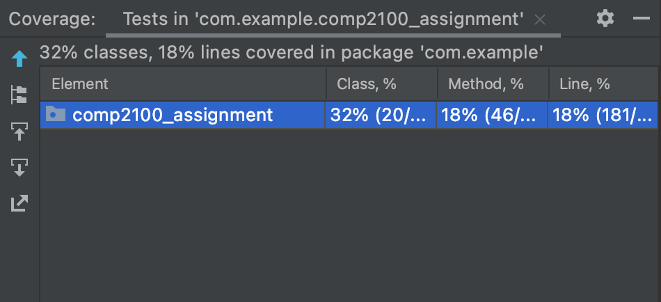
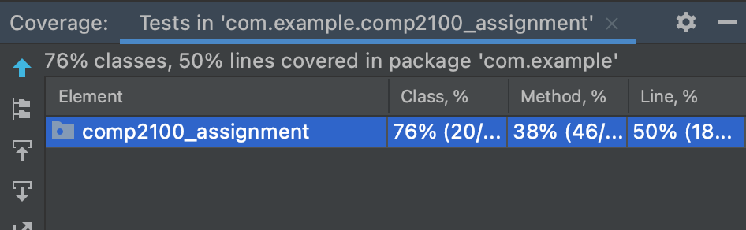
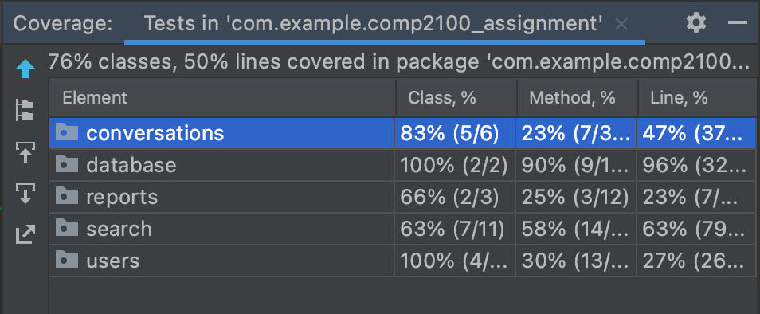

# $500 for a kitchen table and bedside sofa Report

The following is a report about the application developed by the $500 for a kitchen table and bedside sofa team.

## Table of Contents

1. [Team Members and Roles](#team-members-and-roles)
2. [Summary of Individual Contributions](#summary-of-individual-contributions)
3. [Conflict Resolution Protocol](#conflict-resolution-protocol)
4. [Application Description](#application-description)
5. [Application UML](#application-uml)
6. [Application Design and Decisions](#application-design-and-decisions)
7. [Summary of Known Errors and Bugs](#summary-of-known-errors-and-bugs)
8. [Testing Summary](#testing-summary)
9. [Implemented Features](#implemented-features)
10. [Team Meetings](#team-meetings)

## Team Members and Roles

| UID | Name | Role |
| :--- | :----: | ---: |
| u7312578 | Ziling Ouyang | Backend Developer |
| u6710622 | Xingkun Chen | Frontend Developer |
| u7283599 | William Loughton | Backend Developer |
| u7334218 | Zane Gates | Database Manager |

## Summary of Individual Contributions

u7312578, Ziling Ouyang, code contribution percentage: 25%.
* Implemented the DAO pattern
    * Implemented the UserDao for accessing, getting and storing User objects in the Firebase database
    * Implemented the ConversationDao for accessing, getting and storing Conversation objects stored in the Firebase database
* Implemented the binary search tree data structure
    * Created the ability to store all data gotten from the Firebase database into a binary search tree
* Assisted Xingkun Chen with the grammar to be implemented
    * Debugged the Parser.java and Tokenizer.java classes
    * Created the initial skeleton of a grammar before Xingkun completed it
* Implemented search functionality
    * Used Xingkun Chen's code as inspiration before writing up search functionality in SearchActivity.java
    * Enabled users to tap on User displayed after search and become friends with them
* Implemented the ability for Users to login in the LoginActivity.java
    * Somewhat inspired by Xingkun's code logic but using the DAO
* Refactored the DatabaseUserManager to use the DAO
* Collaborated with others to design and complete the User class
* Debugged various features such as text display and user matching
* Wrote parts of the report
    * Conflict resolution protocol
    * Application description
    * Design patterns (partial)
    * Team meetings
* Created the Firebase and DAO slides
* Alternated writing meeting minutes with Zane

u6710622, Xingkun Chen, code contribution percentage: 20%.
* Designed and created the basic UI of application( MainActivity, LoginActivity, SearchActivity, FriendActivity)
* Design and complete the Token and Tokenizer class
* Design and complete the grammar of the SearchActivity
* Design the text, Exp , notExp, OrExp, AndExp, contentText of SearchActivity
* Design and complete the parser of the SearchActivity
* Assisted Zane complete the Register feature in LoginActivity but delete by using of DAO
* Make UI more nice
* Created the majority of the slides

u7283599, William Loughton, code contribution percentage: 25%
* Implemented most JUnit test classes (InteractionTest, ParserTest, UserBinarySearchTreeTest)
* Implemeneted "UI tests using espresso" feature (AccountReportActivityTests, AccountSettingsActivityTests, FriendActivityTests, LoginActivityTests, MainActivityTests, QueueActivityTests, SearchActivityTests)
* Designed and initially added profilePicture and blockedUsers fields and associated methods (User)
* Initially designed and implemented profilePicture UI and display of profilePicture in MainActivity
* Initially designed and implemented password policy (method passwordMeetsPolicy in class LoginActivity)
* Implemented final updateConversationDisplay method based on design and initial implementation by Zane (ConversationActivity)
* Implemented and wrote up Surprise Feature 
* Ported initial project from IntelliJ to AndroidStudio
* Assisted Ziling with debugging and refactoring of Tokenizer and Parser classes
* Created app title with Zane

u7334218, Zane Gates, code contribution percentage: 30%.
* Implemented account settings pages (database, interface and UI)
* Implemented conversation generation (database, interface and UI)
* Implemented account report generation (database, interface and UI)
* Implemented permanent friend conversations (database, interface and UI)
* Implemented logging in and authentication (database and interface)
* Implemented account signups (database and interface)
* Implemented tab-based application menu (interface and UI)
* Wrote unit tests for conversation forming and queueing
* Advised Ziling on how to generate a conversation in the search activity
* Wrote the initial code skeleton for the local backend
* Set-up the Firebase database and related things (e.g. creating a Google account, modifying the build files)
* Sketched all the art used app-wide, including icons, symbols, and animations
* Curated app title with William
* Wrote the App Description and and Implemented Features sections of the report, and prepared the UML diagram
* Shared meeting minute-taking duties with Ziling
* Presented both checkpoints and will present the Minute Madness presentation

## Conflict Resolution Protocol

If the conflict is strictly one of opinion, the group will hold a democratic vote to determine the best course of action for the project. If this vote ends in a tie, the tie-breaker will come from the group member who has been assigned that particular component of the project. (e.g., if the conflict is about the UI, Xingkun will be the tiebreaker vote).

If the conflict is more of personality, we will try to resolve things through conversation, or if really necessary get a third-party person to mediate (e.g., tutor or maybe another unrelated person from the group).

## Application Description

Our application is a messaging/social media app aimed at helping people who want to practice new languages. Each user first creates an account wherein they specify the language they are fluent in and the language they would like to learn. The app then matches users against each other based on language fluency and which language each user would like to learn.

**Application Use Cases and or Examples**

Target Users: Students or amateur learners of a new language, in addition to linguists and polyglots.

A use case of this application is in the case of two students wanting to practice a language taught in school.

1. George is fluent in English but is learning Spanish in school
2. Amy is fluent in Spanish but is learning English in school
3. Both George and Amy want to practice the languages they are learning in school
4. George and Amy create an account of the language learning app and match each other
5. George and Amy chat and improve their understanding of each other's language

When they have a few minutes spare, users may enter a queue to be matched with another user. In the above example, George and Amy would be paired into a conversation to learn English and Spanish from each other, using one of their mutual interests as a topic to spur conversation. These conversations are text-based.

Users who use the app are intended to participate in rapid-fire conversations on a variety of topics, allowing them to practice a variety of grammatical points and a range of vocabulary. The near-anonymity of these conversations allows users to be more comfortable with practising without fear of looking stupid, and reciprocating by using genuine fluent speakers of the language means that the speech patterns and slang learnt will be more naturalistic and users will be exposed to a range of local dialects.

In addition, users who find a conversation they had with another enlightening (for example, they may have very similar interests, or just find that the other is good at explaining concepts) can friend a user who they are paired with. Then, using the friends menu, they may keep up their conversation for a much longer time, rather than having it lost immediately after either presses the back button. This can help to foster engagement with a language and culture on a much deeper level over longer amounts of time.

Finally, users can search for others with which they can form long-term conversations directly, using the search feature. Users added here join teh friends list, from which their conversations can be permanently accessed.

## Application UML

## Application Design and Decisions

**Data Structures**

1. Binary Search Tree

This stores the full set of users as they are loaded from the database in the `UserBinarySearchTreeTest`. This is referenced by the `DatabaseUserManager` which observes the Firebase database for any changes to users and writes these changes to the tree as they occur.

This is a reasonable decision as we will need to add users at random points in the tree frequently as they are loaded from the database. It also allows us to access users very quickly, with O(log n) time. Finally, although users store a wide range of information, we only need to access users by username. Since this is stored alphabetically, it induces an obvious ordering utilisable by the BST, so we don't need some kind of multi-keyed hash map.

2. Hash Maps

Some of the user data is stored with HashMaps, such as their interactions, familiarities, and interests. We use the standard `java.util` implementation in the `User` class.

This is reasonable as any extension to the enumerations involved don't require any modification to the code. If we had used, say, a set, introducing a level of semi-interestedness would break the code. We were also limited by wanting efficient transformations between the serialized content here and the storage on Google Firebase, to minimise both read time and storage space. Some of the other data structures we had considered failed this criteria, as Google Firebase natively supports very few structures.

**Design Patterns**

- DAO pattern: Our team uses the DAO pattern to retrieve, store and update data stored in the Firebase database. This includes the User and Conversation objects. Most access to the database which needed to retrieve a User or Conversation was done through the DAO. These patterns are implemented in the `UserDao` and `ConversationDao`.

- Singleton: Many classes such as the DAO classes (`UserDao` and `ConversationDao`) implement this singleton pattern. In the case of Firebase access, this was to prevent unnecessary connections to the database which would just impact memory.

- Factory: The `ConversationFormer` class is an example of a factory method. It is a factory of conversations and attempts to create different conversations based off of User interest and topics. If the users have topics which supplement each other (e.g., both are interested in sports), the factory method creates a unique conversation. This conversation also forms based on the type of compatible language.

**Grammar**

  *Production Rules*  
\<text\> ::= \<exp\> | \<exp\> "and" \<text\> | \<exp\> "or" \<text\>​
 
\<exp\> ::= \<search\> | "not" \<search\>
  
\<search\> ::= \<content\> | (\<exp\>)​
 
\<content> ::= \<language> | \<topic>
 
\<language> ::= ENGLISH | GERMAN | JAPANESE | etc
 
\<topic> ::= MUSIC | SPORTS | etc

The grammar is able to construct sentences which resemble boolean statements. We took inspiration from both the lectures and also from the grammars learnt in COMP1600. This particular grammar generates expressions such as "Chinese and not German". This is very useful for our language searching function. The advantages of such a design is that we are able to easily evaluate the expression after parsing it. This grammar simplifies the searching function quite a bit by directly allow us to compare if the language/topic should be searched for or not.

**Tokenizer and Parsers**

The tokeniser and parser are used in the SearchActivity. The tokeniser takes the input string the user types into the search bar, and splits it into tokens, each word becoming a token. The possible types are a language (one of the valid languages), a topic (one of the valid topics), a boolean operator (and, or, not, brackets), or a generic word (anything not matching one of the other options). Then, the parser will choose the valid content from tokens which are topics and languages. An advantage of our generic word type is that invalid input, such as a language not implemented in our app, will not break the search, instead acting as a boolean false value in the search. In using the parser we are also able to define the search parameters - whether a given token must be included, can be replaced with another token or must not be included.

**Surprise Feature**
Code Smells
Potential:
  - returning private field from public class (User class, friendship request) (leaky encapsulation) - https://cwe.mitre.org/data/definitions/495.html
    - First commit: 6c843f09ce34468634c41db41f8d6ce50e73ab79, 22/4, lines 21, 24, 32, 40, 58 (User class), 
    - Fixable: Yes, however will not fix.
    - This code smell was identified by the Embold code analysis tool, and is an example of leaky encapsulation. If a field is private, it should not be possible to directly modify that field from outside of the class, with getters and setters used instead.  However, if an object is returned directly by a getter, it can potentially be modified in unintended ways from outside the class. The solution is to not return the original object in a getter method, instead returning a clone. In this case however, we decided that the code analysis tool was being overzealous. While there is a minor risk of the ArraySet being modified in unexpected ways, to change it would be to go against accepted practice, both as taught in the course and as generated by AndroidStudio's automatic getter and setter tools, and for String and boolean values it is completely wrong to clone the object being returned - Strings are cloned automatically, and boolean is a value type, not a reference type. Because of this we decided not to make any changes.
  - public static fields should be final (QueuedUserObserver) - https://cwe.mitre.org/data/definitions/500.html
  - This code smell was also identified by the Embold code analysis tool, and is an example of leaky encapsulation. If a field is public and static but not final, the object referenced by that field can be modified from anywhere in the code, which in our use case of an observer object instance was unintended. The new implementation fixes this by making the field final as well as public and static, preventing it from being changed unexpectedly from a different class.
    - First commit: 1f9976d345c1ed9a82d161259c5e4f95d4af790c, 24/4, line 5
    - Fixed commit: 8f3933708e4fb1e4b85c7accf0acb4aca7315c9e, 13/5, lines 9-12
  - potential god class: User class
    - The user class exhibits characteristics of the "multifaceted abstraction" (god class) code smell, as it has many responsibilities, being used in every activity for both the current user and other users they interact with. It contains many fields and methods used by both the backend (e.g. username) and frontend (e.g. profile picture). However, we decided not to refactor it for 2 main reasons. First, while it has a lot of functionality, all of it makes sense being encapsulated in the User class, and refactoring it could very easily lead to creating other code smells such as "unnecessary abstraction" and "broken modularization". Secondly, we are quite close to the deadline, and refactoring this class, which is a central and critical part of the app, would take a lot of time. In order to try and avoid making the problem any worse, we will try and pay special attention when adding new fields or methods to this class, only adding anything if absolutely necessary.
    - First commit: 6c843f09ce34468634c41db41f8d6ce50e73ab79, whole class
  - Cyclic Dependancy between User and QueuedUserObserver
    - These two classes are both dependent on each other, creating a cyclic dependency. The QueuedUserObserver (renamed from UserQueueObserver) relies on the User class, as it has a list of Users `usersInQueue`, and the User class relies on the QueuedUserObserver in the `enterQueue` and `exitQueue` methods. However, we have not fixed this dependency. The best way to fix it would be to create a generic observer class or interface and create an instance of it which specifically takes into account our needs. However, this would still leave any implementation of the interface containing the functionality we want with a cyclic dependency. Additionally our implementation uses the singleton design pattern anyways, and any implementation which would remove the cyclic dependency would equally remove the benefit of having a single instance we can use to manage the User queue.
        - First commit: 6c843f09ce34468634c41db41f8d6ce50e73ab79, 22/4, lines 10-24 (UserQueueObserver), lines 11, 47-63 (User)

## Summary of Known Errors and Bugs

1. Empty messages can be sent in ConversationActivity. This has only minor visual effects.
2. If network connection is bad/database connection is slow, there is no guarantee that the all Users stored in the database will be accounted for. This may cause small issues such as not all friends loading in immediately.

## Testing Summary

Code coverage: We decided to use 3 different metrics to look at code coverage. First, when looking at the whole project, we achieved 18% line coverage.

However, the assessment rubric mentions that UI should be ignored in line coverage. If we remove all UI from the test coverage calculations, we achieved 33% line coverage.

Because the JUnit test cases are written outside of the code which handles the Android app, the Android Looper (a part of the Handler class) does not run. 

Finally, much of our project (specifically the Dao) relies on the online Firebase database, which cannot be tested due to Looper errors.  The purpose of the Looper is to create a thread loop. This is important for functions such as database access which rely on looping a thread until data is retrieved from the database. As such, tests which rely on the Looper throw errors. For this reason, we decided to additionally remove classes which involved the Dao from coverage calculations. After doing this, we achieved 50% line coverage.

Broken down by package:

In addition to JUnit tests, we have created Espresso UI tests. These cover ~70% of all UI classes.

Types of tests created: We have tested many of the back-end algorithmic features and a large majority of the GUI, but little of the database connections due to the above-mentioned Looper errors.

## Implemented Features

**UI Design and Testing**

_2. UI tests using espresso or similar. Please note that your tests must be of reasonable quality. (For UI testing, you may use something such as espresso) (hard)_

See the written UI tests in the following files:

- AccountSettingsActivityTests.java (whole class)
- FriendActivityTests.java (whole class)
- LoginActivityTests.java (whole class)
- MainActivityTests.java (whole class)
- QueueActivityTests.java (whole class)
- SearchActivityTests.java (whole class)
   
**Greater Data Usage, Handling and Sophistication**

_2. User profile activity containing a media file (image, animation (e.g. gif), video). (easy)_

User profiles contain an avatar picture displayed on the main page and within conversations they are a part of.

This avatar picture may be edited through the account settings page.

- Field stored locally as a string in `User.java`, along with getter and setter methods
- EditText used to change the address in `AccountSettingsActivity.java` and `activity_account_settings.xml`
- Avatars are accessed at various other points (in `ConversationActivity.java`, and `MainActivity.java`)
- Avatars fetched for a user whose username is known through the `UserDao.java` and `DatabaseUserManager.java`
- code to display both avatar and name from the username present in `ConversationActivity.java` (`associateLabel` function)

_4. Report viewer. Provide users with the ability to see a report of interactions with your app (e.g., total views, total likes, total raised for a campaign, etc, in a graphical manner. (medium)_

Users' activities are logged to the `User` class through the `logInteraction` method, which serializes them through the `Interaction.java` class (whole file) to store in the database (with `UserDao`). These are converted to a readable form on the fly by the `ReportGenerator`'s `generateReport` method (lines 22-39).

These reports are visible by accessing the reports page through the user settings page in-app. See lines 84--93 in `AccountSettingsActivity.java` for where the user is passed to the activity, and `onCreate` in `AccountReportActivity.java` for the displaying of the report.

**Peer to Peer Messaging**

_1. Provide users with the ability to message each other or an institution directly (e.g., a user can message an event/movement that is managed by another user). (hard)_

Conversations, both transient and permanent, can be formed between two users. The entire `conversations` package implements the backend of messaging.

Transient conversations are formed in `MainActivity.java` in the `match_listener`.

Permanent conversations are formed either in `ConversationActivity.java` through the `addFriendButton`'s listener (lines 183--204) or in `SearchActivity.java` through clicking on a `ListView` item (lines 118--130).

A conversation is interacted with visually through the `ConversationActivity.java`. In particular, messages are sent in the `sendButton`'s listener (lines 148--152) and are read live from the database through `onChildAdded` to the conversation's root reference (lines 113-128) and displayed `updateConversationDisplay` (lines 297--329).

_3. Provide users with the ability to restrict who can message them by some association (e.g. a setting for: can only message me if we are friends, if we support the same social cause/movement/event). (hard)__

Conversation forming only happens between users who can each teach the other user a language and with a shared interest. See the function `formConversation` in `ConversationFormer.java`, which returns null when a valid conversation cannot be formed. Also see `MainActivity.java` (lines 56--71) to see that conversations are only initiated when the users have this association.

**Firebase Integration**

_1. Use Firebase to implement user Authentication/Authorisation (easy)__

Users are fetched through the `UserDao` and `DatabaseUserManager` classes (whole files).

These are accessed when users try to authenticate by `loginListener` in `LoginActivity.java` (lines 34--53).

_2. Use Firebase to persist all data used in your app (this item replaces the requirement to
retrieve data from a local file) (medium)__

All data is persisted. We perist it through various types of `Dao`s and every class in the `database` package.

The singletons in this class are accessed at every point data is taken from the UI. These are too numerous to list, but include registering in `LoginActivity.java` (lines 60--84), user profile in `MainActivity.java` (lines 103--115), and converastion forming in `MainActivity.java` (lines 52--83).

This can be further verified by the lack of data-storing files on the local system. Credentials to access the Firebase database are accessible in `firebase-login.md` for further proof.

_3. Using Firebase or another remote database to store user information and having the app updated as the remote database is updated without restarting the application. E.g. User A makes a transfer, user B on a separate instance of the application sees user A’s transfer appear on their app instance without restarting their application. (very hard)_

All information is fetched through persistent listeners and therefore actively updates on changes. See each of the clases implementing `Dao` for this behaviour. This is easiest to see live in conversations, in `ConversationActivity.java`'s `onChildAdded` to the conversation root reference (lines 113--128).

## Team Meetings

- [Team Meeting 1](./Meeting1.md)
- [Team Meeting 2](./Meeting2.md)
- [Team Meeting 3](./Meeting3.md)
- [Team Meeting 4](./Meeting4.md)
- [Team Meeting 5](./Meeting5.md)
- [Team Meeting 6](./Meeting6.md)
