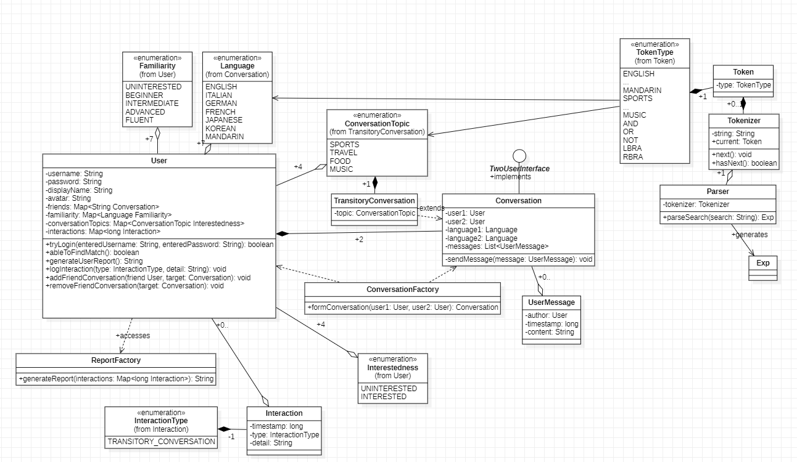
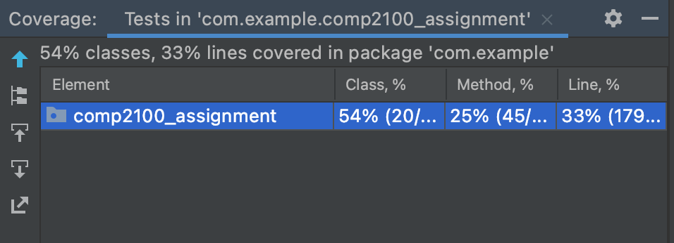

# $500 for a kitchen table and bedside sofa Report

The following is a report about the application developed by the $500 for a kitchen table and bedside sofa team.

## Table of Contents

1. [Team Members and Roles](#team-members-and-roles)
2. [Summary of Individual Contributions](#summary-of-individual-contributions)
3. [Conflict Resolution Protocol](#conflict-resolution-protocol)
4. [Application Description](#application-description)
5. [Application UML](#application-uml)
6. [Application Design and Decisions](#application-design-and-decisions)
7. [Summary of Known Errors and Bugs](#summary-of-known-errors-and-bugs)
8. [Testing Summary](#testing-summary)
9. [Implemented Features](#implemented-features)
10. [Team Meetings](#team-meetings)

## Team Members and Roles

| UID | Name | Role |
| :--- | :----: | ---: |
| u7312578 | Ziling Ouyang | Backend Developer |
| u6710622 | Xingkun Chen | Frontend Developer |
| u7283599 | William Loughton | Backend Developer |
| u7334218 | Zane Gates | Database Manager |

## Summary of Individual Contributions

*[Summarise the contributions made by each member to the project, e.g. code implementation, code design, UI design, report writing, etc.]*

*[Code Implementation. Which features did you implement? Which classes or methods was each member involved in? Provide an approximate proportion in pecentage of the contribution of each member to the whole code implementation, e.g. 30%.]*

u7312578, Ziling Ouyang, code contribution percentage: .
*
*
*

u6710622, Xingkun Chen, code contribution percentage: .
* Create the basic UI of application( MainActivity, LoginActivity, SearchActivity, FriendActivity)
* Design and complete the Token and Tokenizer class
* Design and complete the grammar of the SearchActivity
* Design the text, Exp , notExp, OrExp, AndExp, contentText of SearchActivity
* Design and complete the parser of the SearchActivity
* Assisted Zane complete the Register feature in LoginActivity but delete by using of DAO
* Make UI more nice

u7283599, William Loughton, code contribution percentage: 12.5%
  * Implemented most JUnit test classes (InteractionTest, ParserTest, UserBinarySearchTreeTest)
  * Implemeneted "UI tests using espresso" feature (AccountReportActivityTests, AccountSettingsActivityTests, FriendActivityTests, LoginActivityTests, MainActivityTests, QueueActivityTests, SearchActivityTests)
  * Designed and initially added profilePicture and blockedUsers fields and associated methods (User)
  * Initially designed and implemented profilePicture UI and display of profilePicture in MainActivity
  * Initially designed and implemented password policy (method passwordMeetsPolicy in class LoginActivity)
  * Implemented final updateConversationDisplay method based on design and initial implementation by Zane (ConversationActivity)
  * Implemented and wrote up Surprise Feature 
  * Ported initial project from IntelliJ to AndroidStudio
  * Assisted Ziling with debugging and refactoring of Tokenizer and Parser classes
  * Created app title with Zane
*
*
*

u7334218, Zane Gates, code contribution percentage: .
* Implemented account settings pages (database, interface and UI)
* Implemented conversation generation (database, interface and UI)
* Implemented account report generation (database, interface and UI)
* Implemented permanent friend conversations (database, interface and UI)
* Implemented logging in and authentication (database and interface)
* Implemented account signups (database and interface)
* Implemented tab-based application menu (interface and UI)
* Wrote unit tests for conversation forming and queueing
* Advised Ziling on how to generate a conversation in the search activity
* Wrote the initial code skeleton for the local backend
* Set-up the Firebase database and related things (e.g. creating a Google account, modifying the build files)
* Sketched all the art used app-wide, including icons, symbols, and animations
* Curated app title with William

*[Code Design. What design patterns, data structures, did the involved member propose?]*

*[UI Design. Specify what design did the involved member propose? What tools were used for the design?]*

*[Report Writing. Which part of the report did the involved member write?]*

*[Slide preparation. Were you responsible for the slides?]*

*[Miscellaneous contributions. You are welcome to provide anything that you consider as a contribution to the project or team.]*

## Conflict Resolution Protocol

If the conflict is strictly one of opinion, the group will hold a democratic vote to determine the best course of action for the project. If this vote ends in a tie, the tie-breaker will come from the group member who has been assigned that particular component of the project. (e.g., if the conflict is about the UI, Xingkun will be the tiebreaker vote).

If the conflict is more of personality, we will try to resolve things through conversation, or if really necessary get a third-party person to mediate (e.g., tutor or maybe another unrelated person from the group).

## Application Description

Our application is a messaging/social media app aimed at helping people who want to practice new languages. Each user first creates an account wherein they specify the language they are fluent in and the language they would like to learn. The app then matches users against each other based on language fluency and which language each user would like to learn.

**Application Use Cases and or Examples**

Target Users: Students or amateur learners of a new language.

A use case of this application is in the case of two students wanting to practice a language taught in school.

1. George is fluent in English but is learning Spanish in school
2. Amy is fluent in Spanish but is learning English in school
3. Both George and Amy want to practice the languages they are learning in school
4. George and Amy create an account of the language learning app and match each other
5. George and Amy chat and improve their understanding of each other's language

## Application UML

## Application Design and Decisions

*Please give clear and concise descriptions for each subsections of this part. It would be better to list all the concrete items for each subsection and give no more than `5` concise, crucial reasons of your design. Here is an example for the subsection `Data Structures`:*

*I used the following data structures in my project:*

1. *LinkedList*

   * *Objective: It is used for storing xxxx for xxx feature.*

   * *Locations: line xxx in XXX.java, ..., etc.*

   * *Reasons:*

     * *It is more efficient than Arraylist for insertion with a time complexity O(1)*

     * *We don't need to access the item by index for this feature*

2. ...

3. ...

**Data Structures**

*[What data structures did your team utilise? Where and why?]*

**Design Patterns**

- DAO pattern: Our team uses the DAO pattern to retrieve, store and update data stored in the Firebase database.

- Singleton: Many classes such as the DAO classes implemented the singleton pattern. In the case of Firebase access, this was to prevent unnecessary connections to the database which would just impact memory.

- Observer: 

**Grammar(s)**

  *Production Rules*  
\<text\> ::= \<exp\> | \<exp\> "and" \<text\> | \<exp\> "or" \<text\>​
 
\<exp\> ::= \<search\> | "not" \<search\>
  
\<search\> ::= \<content\> | (\<exp\>)​

*[How do you design the grammar? What are the advantages of your designs?]*

This grammar is designed based on the lab task we learnt. In this grammar, it could divide the tokenizer with "and" ,"or" and anlyse it.

*If there are several grammars, list them all under this section and what they relate to.*

**Tokenizer and Parsers**

*[Where do you use tokenisers and parsers? How are they built? What are the advantages of the designs?]*

The tokenisers and the parsers are used in the SearchActivity. The tokenisers will define the sentences word by word into tokens. Then, the parser will choose the valid content from tokens which are topics and languages. By using parser, it could also define the content should be contained or not.

**Surprise Feature**
Code Smells
Potential:
  - returning private field from public class (User class, friendship request) (leaky encapsulation) - https://cwe.mitre.org/data/definitions/495.html
    - First commit: 2c2a096df05bc1ee5e74a1c79160094041051f7d, 22/4, lines 21, 24, 32, 40, 58 (User class), 
    - fixable: yes!
    - Fixed commit: TBD
  - public static fields should be final (QueuedUserObserver) - https://cwe.mitre.org/data/definitions/500.html
  - This code smell was also identified by the Embold code analysis tool, and is an example of leaky encapsulation. If a field is public and static but not final, the object referenced by that field can be modified from anywhere in the code, which in our use case of an observer object instance was unintended. The new implementation fixes this by making the field final as well as public and static, preventing it from being changed unexpectedly from a different class.
    - First commit: 1f9976d345c1ed9a82d161259c5e4f95d4af790c, 24/4, line 5
    - Fixed commit: 8f3933708e4fb1e4b85c7accf0acb4aca7315c9e, 13/5, lines 9-12
  - potential god class: User class
    - The user class exhibits characteristics of the "multifaceted abstraction" (god class) code smell, as it has many responsibilities, being used in every activity for both the current user and other users they interact with. It contains many fields and methods used by both the backend (e.g. username) and frontend (e.g. profile picture). However, we decided not to refactor it for 2 main reasons. First, while it has a lot of functionality, all of it makes sense being encapsulated in the User class, and refactoring it could very easily lead to creating other code smells such as "unnecessary abstraction" and "broken modularization". Secondly, we are quite close to the deadline, and refactoring this class, which is a central and critical part of the app, would take a lot of time. In order to try and avoid making the problem any worse, we will try and pay special attention when adding new fields or methods to this class, only adding anything if absolutely necessary.
    - First commit: 6c843f09ce34468634c41db41f8d6ce50e73ab79, whole class
  - Cyclic Dependancy between User and QueuedUserObserver
    - These two classes are both dependent on each other, creating a cyclic dependency. The QueuedUserObserver (renamed from UserQueueObserver) relies on the User class, as it has a list of Users `usersInQueue`, and the User class relies on the QueuedUserObserver in the `enterQueue` and `exitQueue` methods. However, we have not fixed this dependency. The best way to fix it would be to create a generic observer class or interface and create an instance of it which specifically takes into account our needs. However, this would still leave any implementation of the interface containing the functionality we want with a cyclic dependency. Additionally our implementation uses the singleton design pattern anyways, and any implementation which would remove the cyclic dependency would equally remove the benefit of having a single instance we can use to manage the User queue.
        - First commit: 6c843f09ce34468634c41db41f8d6ce50e73ab79, 22/4, lines 10-24 (UserQueueObserver), lines 11, 47-63 (User)

        
**Other**

*[What other design decisions have you made which you feel are relevant? Feel free to separate these into their own subheadings.]*

## Summary of Known Errors and Bugs

1. *Bug 1:* Empty messages can be sent in ConversationActivity. This has only minor visual effects.

*List all the known errors and bugs here. If we find bugs/errors that your team does not know of, it shows that your testing is not thorough.*

## Testing Summary

Code coverage: We decided to use 3 different metrics to look at code coverage. First, when looking at the whole project, we achieved 18% line coverage.

However, the assessment rubric mentions that UI should be ignored in line coverage. If we remove all UI from the test coverage calculations, we achieved 33% line coverage.

Because the JUnit test cases are written outside of the code which handles the Android app, the Android Looper (a part of the Handler class) does not run. 

Finally, much of our project (specifically the Dao) relies on the online Firebase database, which cannot be tested due to Looper errors.  The purpose of the Looper is to create a thread loop. This is important for functions such as database access which rely on looping a thread until data is retrieved from the database. As such, tests which rely on the Looper throw errors. For this reason, we decided to additionally remove classes which involved the Dao from coverage calculations. After doing this, we achieved 50% line coverage.

Broken down by package:

In addition to JUnit tests, we have created Espresso UI tests. These cover ~70% of all UI classes.

Types of tests created: We have tested many of the back-end algorithmic features and a large majority of the GUI, but little of the database connections due to the above-mentioned Looper errors.

## Implemented Features

**User Interactivity**

_1. The ability to micro-interact with items in your app (e.g. like/dislike/support/report a post/message/event) [stored in-memory]. (easy)_

_2. UI tests using espresso or similar. Please note that your tests must be of reasonable quality. (For UI testing, you may use something such as espresso) (hard)_
    - AccountSettingsActivityTests.java (whole class)
    - FriendActivityTests.java (whole class)
    - LoginActivityTests.java (whole class)
    - MainActivityTests.java (whole class)
    - QueueActivityTests.java (whole class)
    - SearchActivityTests.java (whole class)
   
**Greater Data Usage, Handling and Sophistication**

_2. User profile activity containing a media file (image, animation (e.g. gif), video). (easy)_

User profiles contain an avatar picture displayed on the main page and within conversations they are a part of.

This avatar picture may be edited through the account settings page.

- Field stored locally as a string in `User.java`, along with getter and setter methods
- EditText used to change the address in `AccountSettingsActivity.java` and `activity_account_settings.xml`
- Avatars are accessed at various other points (in `ConversationActivity.java`, and `MainActivity.java`)
- Avatars fetched for a user whose username is known through the `UserDao.java` and `DatabaseUserManager.java`
- code to display both avatar and name from the username present in `ConversationActivity.java` (`associateLabel` function)

**Peer to Peer Messaging**

_1. Provide users with the ability to message each other or an institution directly (e.g., a
user can message an event/movement that is managed by another user). (hard)__
_3. Provide users with the ability to restrict who can message them by some association
(e.g. a setting for: can only message me if we are friends, if we support the same social
cause/movement/event). (hard)__

**Firebase Integration**

_1. Use Firebase to implement user Authentication/Authorisation (easy)__
_2. Use Firebase to persist all data used in your app (this item replaces the requirement to
retrieve data from a local file) (medium)__
_3. Using Firebase or another remote database to store user information and having the
app updated as the remote database is updated without restarting the application. E.g.
User A makes a transfer, user B on a separate instance of the application sees user A’s
transfer appear on their app instance without restarting their application. (very hard)_

## Team Meetings

- [Team Meeting 1](./Meeting1.md)
- [Team Meeting 2](./Meeting2.md)
- [Team Meeting 3](./Meeting3.md)
- [Team Meeting 4](./Meeting4.md)
- [Team Meeting 5](./Meeting5.md)
- [Team Meeting 6](./Meeting6.md)
